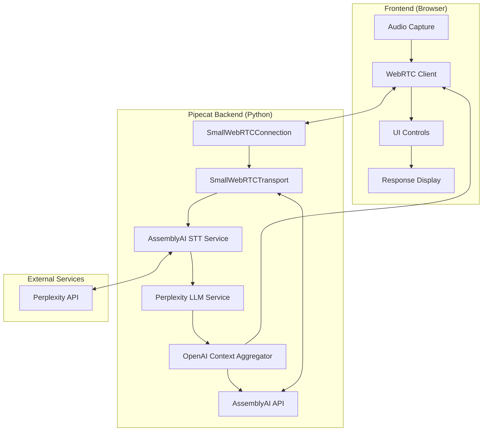
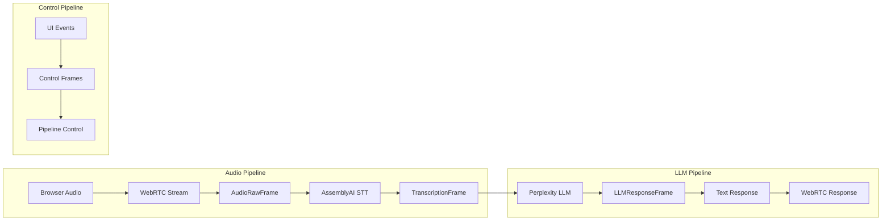

# Pipecat Voice Assistant Architecture Specification

## Executive Summary

This document outlines the migration from a CORS-blocked frontend-only AssemblyAI implementation to a robust Pipecat-based voice pipeline. The new architecture eliminates CORS issues by moving all API interactions to the backend while providing enhanced capabilities through Perplexity LLM's built-in web search functionality.

## Architecture Overview



## Component Architecture



## Detailed Component Breakdown

### 1. Pipecat Backend Architecture

**Core Services:**
- **SmallWebRTCConnection**: WebRTC connection management with ICE servers
- **SmallWebRTCTransport**: P2P WebRTC transport for browser audio streaming
- **AssemblyAI STT Service**: Streaming speech-to-text with native Pipecat integration
- **Perplexity LLM Service**: LLM with built-in web search capabilities
- **OpenAI Context Aggregator**: Manages conversation context and LLM interactions
- **Pipeline Task**: Orchestrates the audio → STT → LLM → response flow

**Key Pipecat Components:**
```python
# WebRTC connection setup
ice_servers = [IceServer(urls="stun:stun.l.google.com:19302")]
webrtc_connection = SmallWebRTCConnection(ice_servers)
await webrtc_connection.initialize(sdp=request["sdp"], type=request["type"])

# Transport with VAD
SmallWebRTCTransport(
    webrtc_connection=webrtc_connection,
    params=TransportParams(
        audio_in_enabled=True,
        audio_out_enabled=True,
        vad_analyzer=SileroVADAnalyzer(),
        audio_out_10ms_chunks=2
    )
)

# Services
AssemblyAISTTService(api_key=assemblyai_api_key)
PerplexityLLMService(
    api_key=perplexity_api_key,
    model="llama-3.1-sonar-small-128k-online"
)

# Context management
context = OpenAILLMContext([...])
context_aggregator = llm.create_context_aggregator(context)
```

### 2. Project Structure

```
voice-assistant/
├── backend/
│   ├── main.py                 # FastAPI server with Pipecat integration
│   ├── pipeline.py             # Pipecat pipeline configuration
│   ├── services/
│   │   ├── __init__.py
│   │   ├── stt_service.py      # AssemblyAI STT wrapper
│   │   ├── llm_service.py      # Perplexity LLM wrapper
│   │   └── transport.py        # WebRTC transport setup
│   ├── processors/
│   │   ├── __init__.py
│   │   └── response_processor.py  # Text response formatting
│   ├── config.py               # Configuration management
│   └── requirements.txt
├── frontend/
│   ├── index.html              # Updated UI (simplified)
│   ├── script.js               # WebRTC client implementation
│   └── style.css               # Updated styles
└── README.md
```

### 3. API Endpoints and Communication

**Backend API Endpoints:**
```python
# FastAPI endpoints
POST /api/offer          # WebRTC offer/answer exchange
GET  /api/health         # Health check
POST /api/start          # Start voice session
POST /api/stop           # Stop voice session
```

**WebRTC Communication Flow:**
1. Browser creates WebRTC offer with audio track
2. Backend receives offer via `/api/offer`
3. SmallWebRTCConnection initializes with offer and ICE servers
4. SmallWebRTCTransport processes audio stream with VAD
5. AssemblyAI STT converts audio to text
6. OpenAI Context Aggregator manages conversation context
7. Perplexity LLM processes text and searches web if needed
8. Text response sent back via WebRTC transport

### 4. Frontend Modifications

**Simplified Frontend Changes:**
- Remove AssemblyAI direct integration (CORS issue resolved)
- Remove API key inputs (backend handles all API calls)
- Implement WebRTC offer/answer exchange
- Add WebRTC data channel for receiving text responses
- Maintain existing UI for transcription display and LLM insights

**Key Frontend Components:**
```javascript
// WebRTC setup for Pipecat backend
const createWebRTCConnection = async () => {
    const pc = new RTCPeerConnection({
        iceServers: [
            { urls: ["stun:stun.l.google.com:19302"] }
        ]
    });
    
    // Add audio track
    const stream = await navigator.mediaDevices.getUserMedia({audio: true});
    pc.addTransceiver(stream.getAudioTracks()[0], {direction: 'sendonly'});
    
    // Create offer and send to backend
    const offer = await pc.createOffer();
    await pc.setLocalDescription(offer);
    
    const response = await fetch('/api/offer', {
        method: 'POST',
        headers: {'Content-Type': 'application/json'},
        body: JSON.stringify({sdp: offer.sdp, type: offer.type})
    });
    
    const answer = await response.json();
    await pc.setRemoteDescription(answer);
    
    return pc;
};
```

### 5. Configuration and Environment

**Environment Variables:**
```bash
# Backend configuration
ASSEMBLYAI_API_KEY=your_assemblyai_key
PERPLEXITY_API_KEY=your_perplexity_key
HOST=localhost
PORT=8000
LOG_LEVEL=INFO
```

**Dependencies:**
```python
# requirements.txt
pipecat-ai[assemblyai,perplexity,webrtc]
fastapi
uvicorn
python-dotenv
```

### 6. Implementation Roadmap

**Phase 1: Backend Setup**
1. Set up FastAPI server with Pipecat integration
2. Configure SmallWebRTCTransport
3. Integrate AssemblyAI STT service
4. Add Perplexity LLM service
5. Create basic pipeline orchestration

**Phase 2: WebRTC Integration**
1. Implement WebRTC offer/answer endpoint
2. Set up audio streaming from browser to backend
3. Configure audio processing pipeline
4. Test STT functionality

**Phase 3: LLM Integration**
1. Connect STT output to Perplexity LLM
2. Configure web search capabilities
3. Implement response formatting
4. Set up text response delivery via WebRTC data channel

**Phase 4: Frontend Migration**
1. Remove CORS-blocked AssemblyAI code
2. Implement WebRTC client
3. Update UI for new architecture
4. Test end-to-end functionality

**Phase 5: Testing and Optimization**
1. Test audio quality and latency
2. Optimize pipeline performance
3. Add error handling and reconnection logic
4. Performance tuning

## Technical Specifications

### Audio Processing
- **Sample Rate**: 16kHz (optimal for AssemblyAI)
- **Channels**: Mono (1 channel)
- **Format**: PCM 16-bit
- **Chunk Size**: 40ms (configurable via `audio_out_10ms_chunks`)

### STT Configuration
- **Service**: AssemblyAI STT Service
- **Features**: 
  - Streaming transcription
  - Language detection
  - Audio passthrough enabled
  - Real-time processing

### LLM Configuration
- **Service**: OpenAI LLM Service (configured for OpenRouter)
- **Model**: `anthropic/claude-3.5-sonnet`
- **Base URL**: `https://openrouter.ai/api/v1`
- **Features**:
  - High-quality reasoning and conversation
  - Large context window
  - Function calling support
  - Access to multiple model providers via OpenRouter

### WebRTC Configuration
- **Transport**: SmallWebRTCTransport (P2P)
- **STUN Server**: Google's public STUN server
- **Audio Direction**: Send-only from browser
- **Data Channel**: For text responses

## Key Benefits of This Architecture

1. **CORS Resolution**: Backend handles all API calls, eliminating browser CORS issues
2. **Streaming STT**: Real-time transcription with AssemblyAI's streaming API
3. **Built-in Web Search**: Perplexity LLM provides web search without additional tools
4. **Simplified Frontend**: No API key management in browser
5. **Scalable**: Pipecat pipeline can be extended with additional processors
6. **PoC-Friendly**: Minimal error handling as requested, focus on core functionality

## Performance Considerations

- **Audio Latency**: ~100-200ms for STT processing
- **LLM Response**: ~1-3s depending on query complexity and web search
- **WebRTC Overhead**: Minimal for P2P connection
- **Memory Usage**: Moderate due to audio buffering and pipeline processing

## Security Considerations

- API keys stored securely on backend
- No sensitive data exposed to frontend
- WebRTC provides encrypted audio transmission
- CORS issues eliminated through backend proxy

## Migration Strategy

### From Current Implementation
1. **Preserve UI**: Keep existing HTML/CSS structure
2. **Replace Audio Capture**: Switch from direct AssemblyAI to WebRTC
3. **Remove API Keys**: Move all authentication to backend
4. **Update JavaScript**: Implement WebRTC client logic
5. **Test Incrementally**: Validate each component before integration

### Rollback Plan
- Keep current frontend as backup
- Implement feature flags for gradual migration
- Maintain API compatibility during transition

## Future Enhancements

### Potential Extensions
1. **TTS Integration**: Add text-to-speech for voice responses
2. **Multi-language Support**: Leverage AssemblyAI language detection
3. **Custom Tools**: Add additional function calling capabilities
4. **Conversation Memory**: Implement conversation context persistence
5. **Analytics**: Add usage tracking and performance metrics

### Scalability Options
1. **Load Balancing**: Multiple Pipecat backend instances
2. **Cloud Deployment**: Container-based deployment
3. **CDN Integration**: Static asset optimization
4. **Database Integration**: Persistent conversation storage

## Conclusion

This architecture provides a robust foundation for migrating from the CORS-blocked frontend implementation to a scalable, backend-driven voice assistant. The combination of Pipecat's streaming capabilities, AssemblyAI's reliable STT, and Perplexity's web-enabled LLM creates a powerful voice interaction system suitable for proof-of-concept development and future production scaling.

The design prioritizes simplicity for PoC requirements while maintaining extensibility for future enhancements. The elimination of CORS issues and the integration of web search capabilities significantly enhance the system's functionality compared to the original implementation.